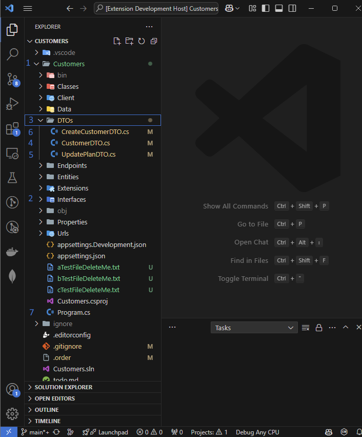
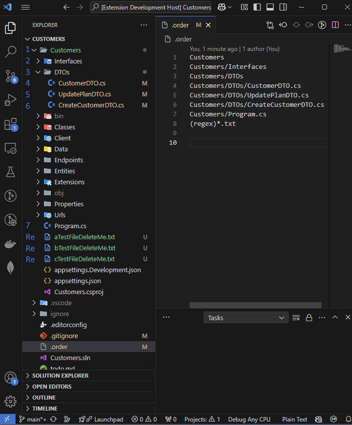

# SortMyFiles VSCode Extension

Re-order files and folders in VS Code explorer. Create a file named `.order` in the root of your workspace.
List the file names in the order you wish. One line for a file. You can also use regex if you put `(regex)` at the start of the line.

Example `.order` file:

    VeryImportantFolder
    MyFolder/MyCode.js
    MyFolder/MyLibrary.js
    ImportantFile.js
    LessImportantFile.js
    (regex)*.json

## How it works

Changes file sorting to last modified date.
Everytime a save detected extension activates.
Changes the last modified date of the files specified in the `.order` file.
Sorts rest of the files alphabetically.
Only works if you open a worspace (folder)

[VSCode Marketplace Page](https://marketplace.visualstudio.com/items?itemName=CanklotSoftware.SortMyFiles)

## Known Issues

Folders are always displayed first.

If you face any problems, you can find the logs in `OUTPUT` tab. From the drop-down menu you can select `SortMyFiles`  and check the logs.

## Screen Shots

BEFORE             |  AFTER
:-------------------------:|:-------------------------:
  |  

## Release Notes

### 0.1.0

Initial release of extension

### 0.1.3

Sort rest of the files alphabetically

### 0.1.4

Regex support

# Buy me a coffe
https://buymeacoffee.com/canklot

